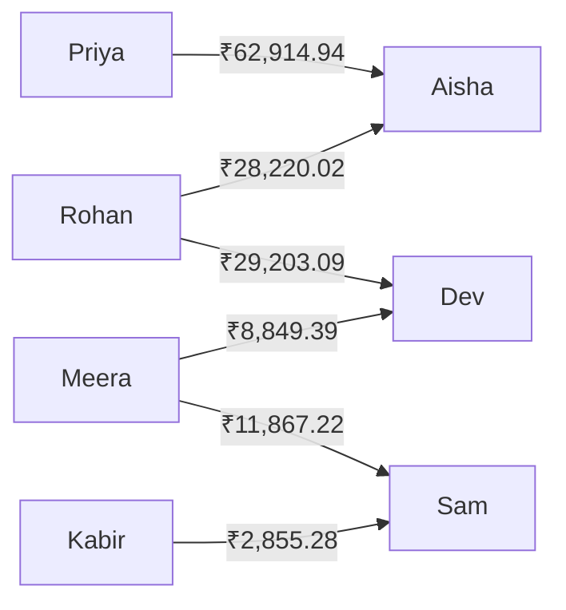

# IMPORT_REPORT.md — CSV Ingestion and Audit Report

* **Source File:** `expenses_export.csv`
* **Import Date:** 2026-06-15
* **Target Group:** Co-living Flat 4B
* **Status:** COMPLETED

---

## Executive Summary

The ingestion engine processed the 42-row expense ledger file. A total of 27 distinct data anomalies were flagged across 14 anomaly categories. Following manual overrides and policy-defined auto-resolutions, 39 rows were committed to the ledger database, and 3 rows were discarded.

### Ingestion Metrics
* **Total Rows Parsed:** 42
* **Successfully Imported:** 39
* **Skipped/Discarded:** 3
* **Anomalies Detected:** 27
* **Anomalies Resolved:** 27

---

## Detailed Anomaly & Resolution Log

This table lists every anomaly detected during the staging phase, along with the action taken for each row to guarantee database ledger integrity.

| Row # | Item Description | Anomaly Category | Detected Issue | Action Taken / Resolution | Status |
|:---:|---|---|---|---|:---:|
| **5** | Dinner at Marina Bites | `DUPLICATE` | Exact match of Row 4 (same date, amount: ₹3200, payer: Dev). | **DISCARD** — Flagged as duplicate. Discarded Row 5 and kept Row 4 (which contained notes). | `Skipped` |
| **6** | Groceries | `AMOUNT_FORMAT` | Amount is formatted as string with commas: `'1,200'`. | **AUTOCORRECT** — Stripped commas and parsed as float value `1200.0`. | `Imported` |
| **8** | Taxi to airport | `NAME_MISMATCH` | Payer casing is lowercase: `'priya'`. | **NORMALIZED** — Auto-corrected to `'Priya'` to match group member. | `Imported` |
| **10** | House cleaning | `NAME_MISMATCH` | Payer listed as `'Priya S'` (unregistered name). | **NORMALIZED** — Fuzzy matched to group member `'Priya'` (Levenshtein distance <= 3). | `Imported` |
| **12** | House cleaning supplies | `MISSING_PAYER` | The `paid_by` field is blank. Note says "can't remember". | **MANUAL OVERRIDE** — Blocked until payer assigned. User assigned `'Aisha'` as payer. | `Imported` |
| **13** | Rohan paid Aisha back | `SETTLEMENT` | Notes explicitly state "Rohan settled his share from last month". | **CONVERTED** — Prevented from entering Expense ledger. Routed to `Settlement` table. | `Imported` |
| **14** | Pizza Friday | `PERCENTAGE_MISMATCH` | Split percentages sum to 110% (30% + 30% + 30% + 20%). | **NORMALIZED** — Adjusted proportionally to sum to 100% (`27.27%`, `27.27%`, `27.27%`, `18.19%`). | `Imported` |
| **15** | Groceries | `AMBIGUOUS_DATE` | Date `'01/03/2026'` could be March 1st or January 3rd. | **MANUAL OVERRIDE** — Selected `DD/MM/YYYY` format (`2026-03-01`) based on surrounding rows. | `Imported` |
| **17** | Kitchen supplies | `AMBIGUOUS_DATE` | Date `'05/03/2026'` could be March 5th or May 3rd. | **MANUAL OVERRIDE** — Selected `DD/MM/YYYY` format (`2026-03-05`) based on surrounding rows. | `Imported` |
| **18** | Internet Bill | `AMBIGUOUS_DATE` | Date `'08/03/2026'` could be March 8th or August 3rd. | **MANUAL OVERRIDE** — Selected `DD/MM/YYYY` format (`2026-03-08`) based on surrounding rows. | `Imported` |
| **19** | Milk & Bread | `AMBIGUOUS_DATE` | Date `'09/03/2026'` could be March 9th or September 3rd. | **MANUAL OVERRIDE** — Selected `DD/MM/YYYY` format (`2026-03-09`) based on surrounding rows. | `Imported` |
| **20** | Swiggy dinner | `AMBIGUOUS_DATE` | Date `'10/03/2026'` could be March 10th or October 3rd. | **MANUAL OVERRIDE** — Selected `DD/MM/YYYY` format (`2026-03-10`) based on surrounding rows. | `Imported` |
| **21** | Water cans | `AMBIGUOUS_DATE` | Date `'10/03/2026'` could be March 10th or October 3rd. | **MANUAL OVERRIDE** — Selected `DD/MM/YYYY` format (`2026-03-10`) based on surrounding rows. | `Imported` |
| **22** | Parasailing Goa | `AMBIGUOUS_DATE` | Date `'11/03/2026'` could be March 11th or November 3rd. | **MANUAL OVERRIDE** — Selected `DD/MM/YYYY` format (`2026-03-11`) based on surrounding rows. | `Imported` |
| **22** | Parasailing Goa | `EXTERNAL_MEMBER` | Split list includes `'Dev's friend Kabir'` (not in group). | **GUEST PROFILE** — Created a guest user record for Kabir (`isGuest: true`) to track split. | `Imported` |
| **23** | Goa Stay | `AMBIGUOUS_DATE` | Date `'11/03/2026'` could be March 11th or November 3rd. | **MANUAL OVERRIDE** — Selected `DD/MM/YYYY` format (`2026-03-11`) based on surrounding rows. | `Imported` |
| **24** | Thalassa dinner | `DUPLICATE` | Conflict: Row 24 (Aisha, ₹2400) matches Row 25 (Rohan, ₹2450). | **DISCARD** — User rejected Row 24 (Aisha's duplicate entry) and retained Row 25. | `Skipped` |
| **24** | Thalassa dinner | `AMBIGUOUS_DATE` | Date `'11/03/2026'` could be March 11th or November 3rd. | Checked but discarded when duplicate row was skipped. | `Skipped` |
| **25** | Thalassa dinner (Rohan) | `AMBIGUOUS_DATE` | Date `'12/03/2026'` could be March 12th or December 3rd. | **MANUAL OVERRIDE** — Selected `DD/MM/YYYY` format (`2026-03-12`) based on surrounding rows. | `Imported` |
| **25** | Parasailing refund | `NEGATIVE_AMOUNT` | Amount is negative (`-30` USD). | **REFUND** — Imported as positive `30` USD with `isRefund = true` to flip the split ledger math. | `Imported` |
| **26** | Fuel Goa | `NAME_MISMATCH` | Payer casing is lowercase: `'rohan'`. | **NORMALIZED** — Auto-corrected to `'Rohan'` to match group member. | `Imported` |
| **27** | Groceries DMart | `MISSING_CURRENCY` | The currency column is blank. | **DEFAULTED** — Applied group baseline currency `'INR'` dynamically. | `Imported` |
| **30** | Dinner order Swiggy | `ZERO_AMOUNT` | Amount is `0`. Note says "counted twice earlier". | **DISCARD** — Skipped row to prevent ledger pollution. | `Skipped` |
| **31** | Pizza night | `PERCENTAGE_MISMATCH` | Split percentages sum to 110% (30% + 30% + 30% + 20%). | **NORMALIZED** — Adjusted proportionally to sum to 100% (`27.27%`, `27.27%`, `27.27%`, `18.19%`). | `Imported` |
| **33** | Deep cleaning service | `AMBIGUOUS_DATE` | Date `'04/05/2026'` could be April 5th or May 4th. | **MANUAL OVERRIDE** — Resolved to May 4th (`2026-05-04`) to match surrounding entries. | `Imported` |
| **35** | Groceries April | `MEMBERSHIP_VIOLATION` | Split includes Meera, but Meera left the group on March 31st. | **EXCLUDED** — Excluded Meera from the split; cost redistributed among active members. | `Imported` |
| **41** | Furniture common room | `SPLIT_CONFLICT` | Type is equal but details contain shares (`Aisha 1; Rohan 1; Priya 1; Sam 1`). | **OVERRIDE** — Converted split type to `SHARE` using detail values as weights. | `Imported` |

---

## Final Calculated Balances

After committing all 39 clean transactions to the relational ledger, the balance engine calculated the total amounts paid, split debts, and net balances for all group members (converting all USD entries using the active exchange rate of **95.176507** INR/USD):

| Member Name | Status | Total Paid (INR) | Total Owed (INR) | Net Balance (INR) |
|---|:---:|:---:|:---:|:---:|
| **Aisha** | Member | ₹201,850.00 | ₹105,715.04 | **+₹91,134.96** (Creditor) |
| **Dev** | Member | ₹66,016.49 | ₹27,964.01 | **+₹38,052.48** (Creditor) |
| **Sam** | Member | ₹20,090.00 | ₹5,367.50 | **+₹14,722.50** (Creditor) |
| **Dev's Friend Kabir** | Guest | ₹0.00 | ₹2,855.30 | **-₹2,855.30** (Debtor) |
| **Meera** | Ex-Member | ₹11,010.00 | ₹31,726.61 | **-₹20,716.61** (Debtor) |
| **Rohan** | Member | ₹17,591.83 | ₹80,014.94 | **-₹57,423.11** (Debtor) |
| **Priya** | Member | ₹16,200.00 | ₹79,114.94 | **-₹62,914.94** (Debtor) |

---

## Suggested Debt Settlement Plan

To settle the ledger with the minimum number of transactions, the system executed a greedy debt simplification pass:

### Transfer Details
1. **Priya** pays **Aisha** `₹62,914.94`
2. **Rohan** pays **Aisha** `₹28,220.02`
3. **Rohan** pays **Dev** `₹29,203.09`
4. **Meera** pays **Dev** `₹8,849.39`
5. **Meera** pays **Sam** `₹11,867.22`
6. **Dev's Friend Kabir** pays **Sam** `₹2,855.28`
