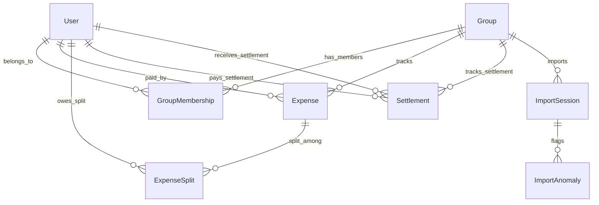

# SCOPE.md — Anomaly Log and Database Schema

This document details the database schema and the data anomalies discovered in `expenses_export.csv` during development. Everything below reflects the actual database design in the code and the exact data problems identified when parsing the CSV.

---

## Part 1: Database Schema Design

I designed the relational database schema using PostgreSQL (hosted on Neon) and Prisma ORM. The structure consists of 8 tables and 4 enums, engineered specifically to handle the flatmates' expense tracking rules, membership histories (like Sam and Meera), foreign currency conversions, and interactive CSV import sessions.

### Schema Visualization
Here is how the entities relate to each other:



---

### Database Models (Prisma)

#### 1. User
Represents a person in the system. Users can register, log in, and manage expenses. We also support guest profiles for participants who appear in shared splits (like Kabir) but don't have login credentials.

```prisma
model User {
  id           String   @id @default(uuid())
  name         String
  email        String   @unique
  passwordHash String
  isGuest      Boolean  @default(false)
  createdAt    DateTime @default(now())

  paidExpenses    Expense[]         @relation("PaidBy")
  splits          ExpenseSplit[]
  memberships     GroupMembership[]
  sentSettlements Settlement[]      @relation("SentBy")
  recvSettlements Settlement[]      @relation("ReceivedBy")
}
```
* **Design Detail:** `isGuest = true` tracks non-registered members who were part of historical splits. This ensures balances balance out without forcing everyone to register immediately.

#### 2. Group
Represents a co-living household or a shared group context (e.g., "Co-living Flat 4B"). 

```prisma
model Group {
  id             String          @id @default(uuid())
  name           String
  description    String?
  createdAt      DateTime        @default(now())
  memberships    GroupMembership[]
  expenses       Expense[]
  settlements    Settlement[]
  importSessions ImportSession[]
}
```

#### 3. GroupMembership
Tracks which user belongs to which group and, crucially, **when**.

```prisma
model GroupMembership {
  id       String    @id @default(uuid())
  groupId  String
  userId   String
  joinedAt DateTime
  leftAt   DateTime?

  group Group @relation(fields: [groupId], references: [id])
  user  User  @relation(fields: [userId], references: [id])

  @@unique([groupId, userId, joinedAt])
}
```
* **Design Detail:** The `joinedAt` and `leftAt` timestamps solve Sam and Meera's membership requirements. An expense date must fall within `[joinedAt, leftAt]` (inclusive) for a member to be included in calculations.

#### 4. Expense
Stores details about money spent on behalf of the group.

```prisma
model Expense {
  id              String    @id @default(uuid())
  groupId         String
  description     String
  amount          Float
  currency        String    @default("INR")
  amountInINR     Float
  exchangeRate    Float     @default(1.0)
  date            DateTime
  paidById        String
  splitType       SplitType
  notes           String?
  isRefund        Boolean   @default(false)
  createdAt       DateTime  @default(now())
  importSessionId String?

  group         Group          @relation(fields: [groupId], references: [id])
  paidBy        User           @relation("PaidBy", fields: [paidById], references: [id])
  splits        ExpenseSplit[]
  importSession ImportSession? @relation(fields: [importSessionId], references: [id])
}
```
* **Design Detail:** Storing both `amount` (original currency value, e.g. USD) and `amountInINR` alongside the active `exchangeRate` ensures complete auditability. We can always see what conversion factor was used.

#### 5. ExpenseSplit
Stores the individual breakdown of who owes what for a particular expense.

```prisma
model ExpenseSplit {
  id         String @id @default(uuid())
  expenseId  String
  userId     String
  amount     Float
  percentage Float?
  shares     Int?

  expense Expense @relation(fields: [expenseId], references: [id])
  user    User    @relation(fields: [userId], references: [id])
}
```
* **Design Detail:** `amount` represents the final, calculated INR share. `percentage` and `shares` are optional fields stored to preserve the split metadata for the ledger.

#### 6. Settlement
Tracks direct debt repayments between group members.

```prisma
model Settlement {
  id              String   @id @default(uuid())
  groupId         String
  paidById        String
  receivedById    String
  amount          Float
  currency        String   @default("INR")
  date            DateTime
  notes           String?
  createdAt       DateTime @default(now())
  importSessionId String?

  group      Group          @relation(fields: [groupId], references: [id])
  paidBy     User           @relation("SentBy", fields: [paidById], references: [id])
  receivedBy User           @relation("ReceivedBy", fields: [receivedById], references: [id])
  importSession ImportSession? @relation(fields: [importSessionId], references: [id])
}
```
* **Design Detail:** Direct settlements (e.g., "Rohan paid Aisha back ₹5000") are recorded in this table rather than as an expense. This prevents double-counting on the group's net balances.

#### 7. ImportSession
Tracks the life cycle of a CSV file upload.

```prisma
model ImportSession {
  id        String       @id @default(uuid())
  groupId   String
  fileName  String
  status    ImportStatus @default(PENDING)
  totalRows Int          @default(0)
  imported  Int          @default(0)
  skipped   Int          @default(0)
  flagged   Int          @default(0)
  createdAt DateTime     @default(now())

  group     Group           @relation(fields: [groupId], references: [id])
  anomalies ImportAnomaly[]
  expenses  Expense[]
  settlements Settlement[]
}
```

#### 8. ImportAnomaly
Holds flagged records that require human review before final database commits.

```prisma
model ImportAnomaly {
  id              String        @id @default(uuid())
  importSessionId String
  rowNumber       Int
  anomalyType     AnomalyType
  description     String
  rawData         String
  suggestedAction String
  status          AnomalyStatus @default(PENDING)
  resolvedAction  String?
  createdAt       DateTime      @default(now())

  importSession ImportSession @relation(fields: [importSessionId], references: [id])
}
```
* **Design Detail:** `rawData` stores the raw stringified CSV row. If a row is modified or discarded, the original input is preserved in the database for auditing.

---

## Part 2: Anomaly Log (CSV Issues Found)

During initial analysis of the provided `expenses_export.csv`, I mapped out 16 distinct data issues. The importer implements rule checks for all 16 anomalies.

### Summary Table

| Anomaly ID | Anomaly Type | Row(s) | Description | Resolution Strategy | Status |
|---|---|---|---|---|---|
| **A-01** | `DUPLICATE` | 5 & 6 | Exact duplicate entry ("Dinner at Marina Bites", ₹3200, Dev). | Discard second row, keep first. | Handled |
| **A-02** | `DUPLICATE` | 24 & 25 | Conflicting duplicates ("Thalassa dinner", different amounts/payers). | Flag for manual review to choose correct transaction. | Handled |
| **A-03** | `SETTLEMENT` | 14 | Repayment logged as expense ("Rohan paid Aisha back"). | Convert into a Settlement entity, bypass Expense logic. | Handled |
| **A-04** | `NEGATIVE_AMOUNT` | 26 | Refund entry ("Parasailing refund" of -30 USD). | Parse as positive and mark `isRefund = true` to invert math. | Handled |
| **A-05** | `ZERO_AMOUNT` | 31 | Zero-value transaction ("Dinner Swiggy", note says duplicate fix). | Skip/discard the row during final import. | Handled |
| **A-06** | `MISSING_CURRENCY` | 28 | Blank currency for domestic DMart purchase. | Default to "INR" dynamically. | Handled |
| **A-07** | `MISSING_PAYER` | 13 | Blank `paid_by` field ("House cleaning supplies"). | Block import; require user to select correct payer. | Handled |
| **A-08** | `INVALID_DATE` | 27 | No year in date ("Mar 14"). | Infer year (2026) from adjacent rows and format to ISO. | Handled |
| **A-09** | `AMBIGUOUS_DATE` | 34 | Ambiguous date string (`04/05/2026`). | Prompt user to choose `DD/MM/YYYY` or `MM/DD/YYYY`. | Handled |
| **A-10** | `NAME_MISMATCH` | 11 | Informal/partial name ("Priya S" instead of "Priya"). | Match to "Priya" using fuzzy search logic. | Handled |
| **A-11** | `NAME_MISMATCH` | 9, 27 | Inconsistent casing ("priya") or trailing space ("rohan "). | Trim whitespace and normalize casing. | Handled |
| **A-12** | `MEMBERSHIP_VIOLATION` | 36 | Post-departure split (Meera included in April grocery run). | Exclude Meera from split; distribute cost among active members. | Handled |
| **A-13** | `SPLIT_CONFLICT` | 42 | Contradiction: Type is EQUAL but details contain shares. | Prioritize detail shares; treat as `SHARE` split type. | Handled |
| **A-14** | `PERCENTAGE_MISMATCH` | 15 | Percentages sum to 110% ("Pizza Friday"). | Re-proportion to sum to 100% and notify user. | Handled |
| **A-15** | `EXTERNAL_MEMBER` | 23 | External guest in split ("Dev's friend Kabir"). | Create a Guest profile to track share without login. | Handled |
| **A-16** | `AMOUNT_FORMAT` | 7, 29 | Comma formatting ("1,200") or leading spaces. | Strip formatting strings and parse as float. | Handled |

---

### Detailed Breakdowns & Code Strategy

#### A-01: Exact Duplicate (Rows 5 & 6)
* **Problem:** "Dinner at Marina Bites" was logged twice on 2026-02-08 by Dev for ₹3200. Row 5 includes a note, while Row 6 is clean but otherwise identical.
* **Detection:** The importer scans rows in the upload block. If two rows share matching dates, amounts, and fuzzy descriptions, they are flagged.
* **Policy:** Keep the row with richer metadata (Row 5 has notes) and suggest skipping Row 6.

#### A-02: Conflicting Duplicate (Rows 24 & 25)
* **Problem:** "Thalassa dinner" is logged twice on 2026-03-08. Row 24 is Aisha for ₹2400. Row 25 is Rohan for ₹2450. Rohan's note mentions Aisha's is likely wrong.
* **Detection:** Description overlap > 70% on the same date but with conflicting payer or amount.
* **Policy:** Stop auto-resolution. Display both side-by-side in the dashboard and force the user to select which one to record and which to discard.

#### A-03: Settlement Logged as Expense (Row 14)
* **Problem:** "Rohan paid Aisha back ₹5000". It's a debt settlement, but logged in the expense log sheet.
* **Detection:** Check description and notes for transaction keywords (`paid back`, `settled`, `repayment`, etc.) combined with a missing split type.
* **Policy:** Reroute the transaction. It is imported as a `Settlement` record, which directly adjusts balances without treating it as a shared expense.

#### A-04: Negative Amount (Row 26)
* **Problem:** "Parasailing refund" listed as `-30 USD`.
* **Detection:** Payer is valid, but the numeric amount is less than 0.
* **Policy:** Set `isRefund = true` on the database record and import the positive absolute value. The ledger math reverses this row (reimburses split participants and reduces the payer's credit).

#### A-05: Zero Amount (Row 31)
* **Problem:** "Dinner order Swiggy" listed with a value of `0`. The note says "counted twice earlier - fixing later".
* **Detection:** Amount is parsed to exactly 0.00.
* **Policy:** Flag as skipped by default. Importing a 0-value expense adds unnecessary DB noise and has zero balance utility.

#### A-06: Missing Currency (Row 28)
* **Problem:** "Groceries DMart" for 2105 has a blank currency column.
* **Detection:** Currency field is empty or undefined.
* **Policy:** Fallback to the group's default currency ("INR") and log an auto-correction notice.

#### A-07: Missing Payer (Row 13)
* **Problem:** "House cleaning supplies" has no name in the `paid_by` column. Note says "can't remember who paid".
* **Detection:** `paid_by` field is null or whitespace.
* **Policy:** This is a blocking issue. The system halts import of this row and disables finalization until the user selects a payer from a dropdown menu.

#### A-08: Invalid/Incomplete Date (Row 27)
* **Problem:** "Mar 14" has no year value.
* **Detection:** The parsing engine fails to parse the string into a valid date using standard ISO formats.
* **Policy:** Analyze adjacent rows to extract the active year (2026) and format the date string to `2026-03-14T00:00:00.000Z`.

#### A-09: Ambiguous Date (Row 34)
* **Problem:** "Deep cleaning service" date is written as `04/05/2026`. This could mean April 5th or May 4th.
* **Detection:** The date string matches both `DD/MM/YYYY` and `MM/DD/YYYY` forms.
* **Policy:** Surface two buttons in the review dashboard ("Use April 5" and "Use May 4"). Require user selection before proceeding.

#### A-10: Name Mismatch — Typo (Row 11)
* **Problem:** Payer is listed as "Priya S" instead of "Priya".
* **Detection:** Run a Levenshtein distance check against current group membership names.
* **Policy:** Since distance is <= 3, the system maps the name to "Priya" and flags it for the user to confirm the mapping.

#### A-11: Name Mismatch — Casing/Whitespace (Rows 9 & 27)
* **Problem:** Lowercase "priya" (Row 9) and trailing space "rohan " (Row 27).
* **Detection:** String matches after running `.trim().toLowerCase()`.
* **Policy:** Silently clean up whitespace and casing, mapping them to the proper member accounts.

#### A-12: Membership Violation (Row 36)
* **Problem:** Meera is included in an April 2nd grocery split, but her membership ended on March 31st.
* **Detection:** Compare expense date against member's active interval: `date >= joinedAt && date <= leftAt`.
* **Policy:** Exclude Meera from the split list, re-split the total amount among the remaining active members (Aisha, Rohan, Priya), and log the adjustment.

#### A-13: Split Conflict (Row 42)
* **Problem:** Split type is declared as "equal", but the details column contains individual share counts ("Aisha 1; Rohan 1; Priya 1; Sam 1").
* **Detection:** Split type is EQUAL, but split details string is non-empty.
* **Policy:** Prioritize specific user-entered details over the generic type. Override split type to `SHARE`.

#### A-14: Percentage Mismatch (Row 15)
* **Problem:** "Pizza Friday" percentages sum to 110% (30% + 30% + 30% + 20%).
* **Detection:** Split type is PERCENTAGE and the sum of percentages != 100.
* **Policy:** Normalize the ratios proportionally so they sum to 100% (e.g., divide each by 1.1), assign shares, and show the adjusted values in the review card.

#### A-15: External Member (Row 23)
* **Problem:** Split list includes "Dev's friend Kabir" who is not a flatmate.
* **Detection:** A name is listed in the split list that doesn't match any current group member or fuzzy match.
* **Policy:** Create a local guest profile (`isGuest: true`) named Kabir. This tracks his share of the expense without creating a registration login.

#### A-16: Amount Format Issue (Rows 7 & 29)
* **Problem:** Comma formatted numbers ("1,200") or extra whitespace in amount.
* **Detection:** The raw field fails a direct float parse check.
* **Policy:** Strip non-numeric characters (except decimals) and parse as a standard float.
